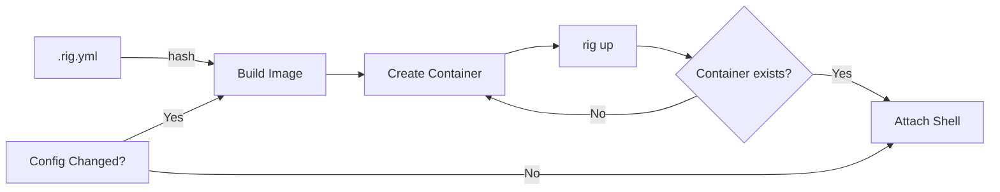

# Rig

**Instant, reproducible development environments for AI-assisted coding.**

Rig creates isolated Docker containers pre-configured with your language runtimes, build tools, and AI coding assistants. One command to enter a fully-equipped sandbox — no manual setup, no "works on my machine" issues.

## Installing

Mac:
```
brew tap wfaler/tap
brew install wfaler/tap/rig
```

Other platforms:
- Have Go installed
- Run `make build`
- Move the `rig` binary to somewhere on your path

## Quick Start

```bash
cd your-project
rig init        # Creates .rig.yml
rig up          # Build and enter the container
```

That's it. You're in a container with your languages, tools, and AI assistants ready to go.

## Why Rig?

- **Zero Setup** — Define your stack in YAML, run `rig up`, and you're coding
- **AI Agents Ready** — Claude Code, Gemini CLI, OpenAI CLI and GitHub CLI pre-installed
- **Documentation Server** — Built-in markdown renderer with live-reload, mermaid diagrams, and dark/light themes
- **VS Code in Browser** — Optional code-server with language extensions, auto-configured
- **Testcontainers Support** — Docker-in-Docker works out of the box (**without** privileged mode)
- **Persistent Sessions** — Your container persists between sessions; instant startup after first build
- **Auto-Rebuild** — Change your config, and the image rebuilds automatically next time you enter

## Why Rig and not Dev Containers?

VS Code Dev Containers are powerful, but they come with trade-offs that Rig avoids:

| | Rig | Dev Containers |
|---|---|---|
| **Config complexity** | Single `.rig.yml` (~10 lines) | `devcontainer.json` + Dockerfile + features |
| **IDE lock-in** | Any editor, terminal, or browser | VS Code (or compatible editors) |
| **AI assistants** | Claude Code, Gemini, OpenAI CLI pre-installed | Manual setup required |
| **Setup time** | `rig init && rig up` | Configure JSON, choose features, debug builds |
| **Testcontainers** | Works out of the box | Requires manual Docker-in-Docker setup |
| **Branch switching** | Same container, instant | Often rebuilds per branch |

### One container, all branches

Dev Containers are often tied to your Git branch or workspace state. Switch branches and you might trigger a rebuild — or worse, lose your installed dependencies and cached builds.

Rig containers are **project-scoped, not branch-scoped**. The container persists based on your `.rig.yml` config hash, not which branch you're on. Switch from `main` to `feature-x` to `hotfix-123` — you're still in the same warm container with all your tools ready. Rebuilds only happen when your environment config actually changes.

### Opinionated so you don't have to be

Dev Containers give you maximum flexibility — and maximum decisions. Rig makes sensible choices:

- **One version manager**: Mise for most languages, SDKMAN for JVM
- **One shell**: Zsh with Oh My Zsh (or bash/fish if you prefer)
- **One base image**: Debian Bookworm, battle-tested
- **Pre-wired for AI**: Every container is ready for AI-assisted development

### Terminal-native, IDE-optional

Rig is built for developers who live in the terminal. Run `rig up` and you're in a shell with everything ready. Want VS Code? Enable `code_server` and open it in your browser — on any machine, any OS.

Dev Containers assume you're opening your project in VS Code. Rig assumes you might be SSHing from an iPad, pairing over tmux, or running Claude Code headless on a CI server.

## Commands

| Command | Description |
|---------|-------------|
| `rig up` | Enter the container (builds if needed) |
| `rig down [name]` | Stop the container (preserves state) |
| `rig destroy [name]` | Stop container and remove all images |
| `rig list` | List running rig containers |
| `rig init` | Create `.rig.yml` template |
| `rig rebuild` | Force clean rebuild of image |

## Configuration

Create `.rig.yml` in your project root:

```yaml
languages:
  node:
    version: "lts"
    build_systems:
      yarn: true
      pnpm: "8.15"       # specify version
  python:
    version: "3.12"
    build_systems:
      poetry: "1.8.0"
      pip: true
  java:
    version: "21"
    build_systems:
      gradle: "8.5"
      maven: true

ports:
  - "3000"
  - "5432:5432"

env:
  API_KEY: "${API_KEY}"  # Expands from host environment

shell: zsh  # zsh with oh-my-zsh (default), bash, or fish

markdown_server:
  port: 3030             # enabled by default

code_server:
  enabled: true
  theme: "Default Dark Modern"
  extensions:
    - github.copilot
```

### Supported Languages

| Language | Versions | Build Systems |
|----------|----------|---------------|
| **Node** | lts, latest, specific (e.g., "20") | npm, yarn, pnpm |
| **Python** | latest, specific (e.g., "3.12") | pip, poetry, pipenv, uv |
| **Go** | latest, specific (e.g., "1.22") | built-in |
| **Java/Kotlin/Scala** | latest, specific (e.g., "21") | gradle, maven, sbt, ant |
| **Rust** | latest, specific (e.g., "1.75") | cargo |
| **Ruby** | latest, specific (e.g., "3.3") | bundler, gem |

### Accessing Host Services

Rig containers can connect to services running on your host machine (databases, APIs, etc.) using the hostname `host.docker.internal`. This works on all platforms.

```bash
# Inside the rig container
psql -h host.docker.internal -p 5432 -U myuser mydb
```

No additional configuration needed — `host.docker.internal` is available in every rig container by default.

## Documentation Server

Every rig container includes a built-in markdown server that renders your project's `.md` files as navigable HTML. Access it at `http://localhost:3030`.

- **Live-reload** — Edit markdown in your editor, see changes instantly in the browser
- **File navigation** — Collapsible directory tree sidebar
- **Mermaid diagrams** — Fenced `mermaid` code blocks render as diagrams
- **Light/dark theme** — Toggle with persistent preference
- **Zero config** — Enabled by default, just open the URL

```yaml
# Optional: change the port
markdown_server:
  port: 4040

# Or disable it
markdown_server:
  enabled: false
```

## Code Server (VS Code in Browser)

Enable `code_server` to get a full VS Code experience in your browser:

```yaml
code_server:
  enabled: true
  port: 8080                    # default, auto-exposed
  theme: "Default Dark Modern"  # any VS Code theme
  extensions:
    - golang.go                 # Go
    - ms-python.python          # Python
    - github.copilot            # AI assistant
```

Run `rig init` to see recommended extensions for each language.

## What's Inside

Every rig container includes:

- **AI Assistants**: Claude Code, Gemini CLI, OpenAI CLI, GitHub CLI
- **Documentation Server**: Live-reload markdown renderer with mermaid support
- **Dev Tools**: git, curl, wget, jq, vim, tmux, build-essential
- **Docker CLI**: For testcontainers and Docker workflows
- **Version Managers**: Mise (polyglot) and SDKMAN (JVM)
- **Shell**: Zsh with Oh My Zsh (default), bash, or fish

## How It Works



1. **Config Hash** — Your `.rig.yml` is hashed to create a unique image tag
2. **Smart Builds** — Images only rebuild when config changes
3. **Persistent Containers** — Named `rig-<project>`, reused across sessions
4. **Socket Mounting** — Docker socket mounted for testcontainers support
5. **Entrypoint Magic** — Permissions and services configured at container start

### Security: No Privileged Mode

Rig does **not** run containers in privileged mode. Instead, it mounts the host's Docker socket (`/var/run/docker.sock`) into the container. This approach:

- **Avoids privileged mode** — No elevated kernel capabilities or direct root access to the host
- **Uses the host's Docker daemon** — Containers you create are siblings, not nested children
- **Works with Testcontainers** — Pre-configured environment variables ensure compatibility

This is safer than true Docker-in-Docker (which requires `--privileged`), while still enabling full Docker workflows inside your development environment.

For maximum isolation (working with untrusted code), run rig inside a VM — just install Docker in the VM and run rig as normal.

## Building from Source

```bash
git clone https://github.com/wfaler/rig.git
cd rig
make build
```

Requires Go 1.22+ and Docker.

## License

MIT
